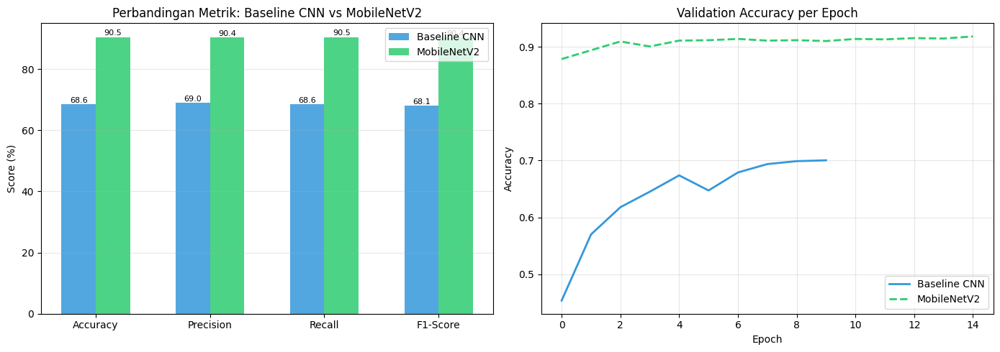
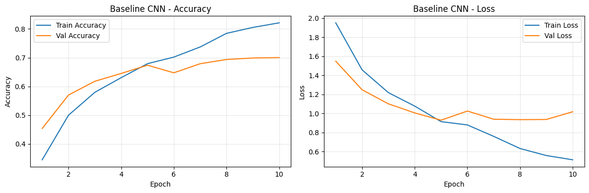
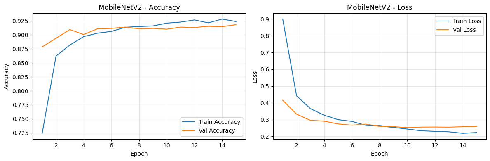
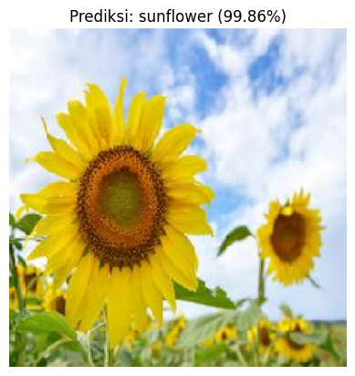
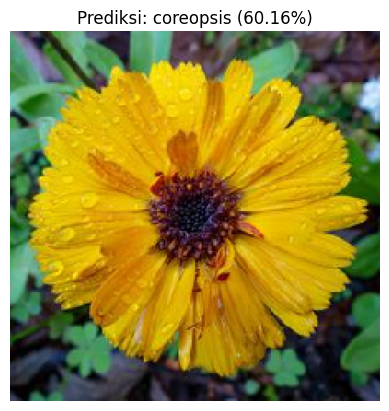
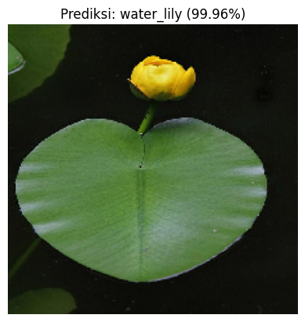

# Klasifikasi 14 Jenis Bunga: CNN Baseline vs MobileNetV2


[](https://colab.research.google.com/github/USERNAME/flower-classification-cnn-vs-mobilenetv2/blob/main/notebooks/Sistem_Cerdas_Tugas_Akhir.ipynb)

Proyek Tugas Akhir mata kuliah **Sistem Cerdas** (Kelompok 5). Kami membandingkan CNN sederhana yang dilatih dari nol dengan **transfer learning MobileNetV2** untuk mengklasifikasikan 14 jenis bunga. MobileNetV2 menaikkan akurasi test dari **68,58% menjadi 90,49%**.



## Hasil

Evaluasi pada test set (1.378 gambar):

| Metrik    | Baseline CNN | MobileNetV2 |
|-----------|-------------:|------------:|
| Accuracy  | 68,58%       | **90,49%**  |
| Precision | 69,00%       | **90,40%**  |
| Recall    | 68,58%       | **90,49%**  |
| F1-Score  | 68,12%       | **90,40%**  |

Precision, recall, dan F1 memakai rata-rata *weighted*.

Baseline CNN mulai overfitting setelah sekitar epoch 5: akurasi train terus naik, sedangkan akurasi validasi mendatar di sekitar 70%. MobileNetV2 sudah mencapai sekitar 88% akurasi validasi sejak epoch pertama karena bobot ImageNet-nya.

| Baseline CNN | MobileNetV2 |
|:---:|:---:|
|  |  |

### Contoh prediksi (MobileNetV2)

| Sunflower | Calendula | Water lily |
|:---:|:---:|:---:|
|  |  |  |

## Dataset

[Flower Classification (Kaggle, marquis03)](https://www.kaggle.com/datasets/marquis03/flower-classification), 14 kelas bunga, lisensi Apache 2.0. Folder `train` bawaan dibagi ulang dengan seed 42:

| Split | Jumlah gambar |
|-------|--------------:|
| Train (80%) | 10.906 |
| Validation (10%) | 1.358 |
| Test (10%) | 1.378 |

Dataset tidak disertakan di repo. Notebook mengunduhnya otomatis lewat Kaggle API.

## Model

| | Baseline CNN | MobileNetV2 |
|---|---|---|
| Arsitektur | 3 blok Conv2D (32, 64, 128) + MaxPooling, Dense 128, Dropout 0,5 | Backbone MobileNetV2 (ImageNet, dibekukan), GlobalAveragePooling, Dropout 0,3 |
| Input | 224×224×3 | 224×224×3 |
| Augmentasi | Random flip vertikal | Random flip vertikal |
| Optimizer / loss | Nadam / categorical crossentropy | Nadam / categorical crossentropy |
| Pelatihan | Maks. 25 epoch, batch 32, EarlyStopping (patience 5) pada `val_loss`, simpan model terbaik | Sama |

## Cara menjalankan

**Google Colab (disarankan):** klik badge *Open in Colab* di atas, pilih runtime GPU, lalu jalankan semua cell. Anda akan diminta mengunggah `kaggle.json` (Kaggle → Settings → Create New Token).

**Lokal:**

```bash
git clone https://github.com/USERNAME/flower-classification-cnn-vs-mobilenetv2.git
cd flower-classification-cnn-vs-mobilenetv2
pip install -r requirements.txt
jupyter notebook notebooks/Sistem_Cerdas_Tugas_Akhir.ipynb
```

Notebook ditulis untuk Colab (memakai `google.colab.files` dan path `/content/`). Untuk menjalankannya lokal, ubah bagian unduh dataset dan path-nya.

## Struktur repo

```
├── notebooks/Sistem_Cerdas_Tugas_Akhir.ipynb   # kode, output, dan analisis
├── docs/Laporan_Tugas_Akhir_Kelompok5.pdf      # laporan lengkap
├── assets/                                     # gambar hasil untuk README
├── requirements.txt
└── LICENSE
```

## Tim

Aditya Ananda Kasi
Dina Arimaya Putri
Anggita Ramanda Sephia
Bonaventura Kevin Andhika Wisesa
## Lisensi

[MIT](LICENSE). Dataset memiliki lisensi sendiri (Apache 2.0) dari penyedianya di Kaggle.
